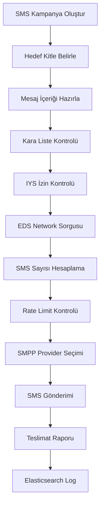

# SMS Gateway Sistemi

Bu proje, Go dili ile geliştirilmiş kurumsal bir SMS Gateway sistemidir. Sistem, SMS gönderimi, kullanıcı yönetimi ve kampanya yönetimi işlemlerini gerçekleştirmek için tasarlanmıştır.

## 📋 İçindekiler

1. [Sistem Mimarisi](#sistem-mimarisi)
2. [Kullanılan Teknolojiler](#kullanılan-teknolojiler)
3. [Sistem Gereksinimleri](#sistem-gereksinimleri)
4. [Kurulum](#kurulum)
5. [Konfigürasyon](#konfigürasyon)
6. [SMS Gönderim Mantığı](#sms-gönderim-mantığı)
7. [API Kullanımı](#api-kullanımı)
8. [Veritabanı Yapısı](#veritabanı-yapısı)
9. [Monitoring ve Loglama](#monitoring-ve-loglama)
10. [Lisanslama](#lisanslama)

## 🏗️ Sistem Mimarisi

SMS Gateway sistemi, modüler bir yapıda tasarlanmış olup aşağıdaki ana bileşenlerden oluşmaktadır:

```
┌─────────────────┐    ┌─────────────────┐    ┌─────────────────┐
│   Web UI/API    │    │   SMS Gateway   │    │   SMPP Providers│
│                 │    │                 │    │                 │
│ • REST API      │◄──►│ • Campaign Mgmt │◄──►│ • Provider 1    │
│ • Authentication│    │ • SMS Queuing   │    │ • Provider 2    │
│ • User Mgmt     │    │ • Rate Limiting │    │ • Provider N    │
└─────────────────┘    └─────────────────┘    └─────────────────┘
         │                       │                       │
         ▼                       ▼                       ▼
┌─────────────────┐    ┌─────────────────┐    ┌─────────────────┐
│    MariaDB      │    │     Redis       │    │ Elasticsearch  │
│                 │    │                 │    │                 │
│ • User Data     │    │ • Caching       │    │ • SMS Logs      │
│ • Campaigns     │    │ • Rate Limits   │    │ • Monitoring    │
│ • Configuration │    │ • Queue Mgmt    │    │ • Reports       │
└─────────────────┘    └─────────────────┘    └─────────────────┘
```

### Kuyruk Sistemi Mimarisi

```
┌─────────────────┐    ┌─────────────────┐    ┌─────────────────┐
│   SMS-BULK      │    │ KUYRUK-GATEWAY  │    │ KUYRUK-NETWORK  │
│                 │    │                 │    │                 │
│ • Campaign Proc │────►│ Gateway Queue   │────►│ Network Queue   │
│ • Contact Proc  │    │ • Provider Mgmt │    │ • Rate Control  │
│ • IYS Check     │    │ • SMPP Connect  │    │ • Queue Balance │
│ • EDS Query     │    │ • Delivery Rep  │    │ • Network Route │
└─────────────────┘    └─────────────────┘    └─────────────────┘
         │                       │                       │
         ▼                       ▼                       ▼
┌─────────────────┐    ┌─────────────────┐    ┌─────────────────┐
│  Redis Queue    │    │  Redis Queue    │    │  Redis Queue    │
│                 │    │                 │    │                 │
│ • campaign:*    │    │ • gateway:*     │    │ • network:*     │
│ • sms-bulk      │    │ • kuyruk-gw     │    │ • kuyruk-net    │
└─────────────────┘    └─────────────────┘    └─────────────────┘
```

## 🛠️ Kullanılan Teknolojiler

### Backend Framework
- **Go 1.23.3** - Ana programlama dili
- **Fiber v2** - Hızlı HTTP web framework
- **JWT** - Kimlik doğrulama ve yetkilendirme

### Veritabanları
- **MariaDB/MySQL** - Ana veritabanı (DBR v2 ile)
- **Redis** - Cache ve kuyruk yönetimi
- **Elasticsearch** - Log analizi ve raporlama

### SMS Protokolleri
- **SMPP (Short Message Peer-to-Peer)** - SMS provider bağlantıları
- **GOSMPP** - SMPP protokol kütüphanesi

### Kuyruk Sistemi
- **Asynq** - Redis tabanlı iş kuyruğu sistemi

### Monitoring ve Logging
- **Custom Console Logging** - Renkli terminal logları
- **Elasticsearch** - Log aggregation

### Güvenlik ve Lisanslama
- **OAuth2** - API kimlik doğrulama
- **Multi-License Manager** - Gelişmiş lisans yönetim sistemi
- **Hardware Fingerprinting** - Anti-cloning koruması
- **IP/MAC Whitelist** - Ağ bazlı güvenlik

### Kuyruk ve Queue Sistemi
- **Asynq** - Redis tabanlı iş kuyruğu sistemi
- **SMS-BULK** - Kampanya işleme ve toplu SMS hazırlama
- **KUYRUK-GATEWAY** - SMPP provider bağlantı yönetimi
- **KUYRUK-NETWORK** - Ağ bazlı kuyruk dağıtımı

### Diğer Önemli Kütüphaneler
- **Swagger/OpenAPI** - API dokümantasyonu
- **UUID** - Benzersiz kimlik oluşturma
- **Godotenv** - Environment variable yönetimi

## 💻 Sistem Gereksinimleri

### Minimum Sistem Gereksinimleri
- **CPU**: 2 core
- **RAM**: 4 GB
- **Disk**: 20 GB SSD
- **OS**: Linux (Ubuntu 20.04+, CentOS 8+ önerilen)

### Yazılım Gereksinimleri
- Go 1.23.3+
- MariaDB 10.5+ / MySQL 8.0+
- Redis 6.0+
- Elasticsearch 8.0+

## 🚀 Kurulum

### 1. Proje Klonlama
```bash
git clone <repository-url>
cd SMS-GW/GO
```

### 2. Bağımlılıkları Yükleme
```bash
go mod download
go mod tidy
```

### 3. Environment Dosyası Oluşturma
```bash
cp .env.example .env
```

### 4. Derleme ve Çalıştırma
```bash
# Derleme
go build -o main main.go

# Ana uygulama çalıştırma
./main

# Kuyruk sistemlerini çalıştırma
./run-sms-bulk.sh          # SMS kampanya işleyici
./run-kuyruk-gateway.sh    # SMPP gateway kuyruk
./run-kuyruk-network.sh    # Network kuyruk sistemi

# Veya direkt çalıştırma
go run main.go
```

### 5. Swagger Dokümantasyonu Güncelleme
```bash
./main swag
```

## ⚙️ Konfigürasyon

### Environment Variables (.env)

```bash
# Veritabanı Bağlantısı
DB_HOST=localhost
DB_PORT=3306
DB_USER=sms_user
DB_PASSWORD=your_password
DB_NAME=sms_gateway

# Redis Bağlantısı
REDIS_CONN=localhost:6379

# Elasticsearch Bağlantısı
ELASTIC_CONN=http://localhost:9200

# Sistem Ayarları
SITE_NAME=SMSC.TR
SITE_UR=https://smsc.tr
LINK_URL=https://link.dev.smsc.tr

# Dosya Yolları
SESDIR=/SMSGW/files/SES/
CVSDIR=/SMSGW/files/CVS/
EXPORTDIR=/SMSGW/files/EXPORT/
BTKCDRDIR=/SMSGW/files/BTK-CDR/
TEMPLATEDIR=/SMSGW/templates/
SWAGGER_DIR=/SMSGW/SMS-GW/GO/docs/

# Lisans Ayarları
PROJECT_ID=sms-gateway
PROJECT_NAME="SMS Gateway"
LICENSE_FILE=license.key
```

### Port Konfigürasyonu
- **Ana Uygulama**: 5333
- **Redis**: 6379
- **MariaDB**: 3306
- **Elasticsearch**: 9200

## 📱 SMS Gönderim Mantığı

### 1. SMS Kampanya Süreci



### 2. SMS Segmentasyon

Sistem, SMS içeriğine göre otomatik segmentasyon yapar:

- **GSM 7-bit**: 160 karakter/segment
- **GSM 7-bit + Turkish Extension**: 160 karakter/segment (Türkçe karakterler için)
- **UCS-2 (Unicode)**: 70 karakter/segment

### 3. Retry Stratejisi

**Normal SMS için**:
- 1. retry: 1 saat sonra
- 2. retry: 2 saat sonra
- 3. retry: 4 saat sonra

**OTP SMS için**:
- 1. retry: 30 saniye sonra
- 2. retry: 1 dakika sonra

### 4. Rate Limiting

Sistem, provider bazında rate limiting uygular:
- Redis tabanlı token bucket algoritması
- Provider'a özgü TPS limitleri
- Dinamik rate limit ayarları

## 🔗 API Kullanımı ve Routing Yapısı

### API Mimarisi

SMS Gateway sistemi, modüler bir routing yapısına sahiptir:

```
┌─────────────────┐    ┌─────────────────┐    ┌─────────────────┐
│   PUBLIC API    │    │   ADMIN API     │    │   STATIC API    │
│                 │    │                 │    │                 │
│ • OAuth Token   │    │ • JWT Protected │    │ • Static Pages  │
│ • Health Check  │    │ • Customer Data │    │ • File Download │
│ • File Download │    │ • SMS Operations│    │ • Documentation │
└─────────────────┘    └─────────────────┘    └─────────────────┘
```

### Routing Kategorileri

#### 1. **SMS ve Kampanya Yönetimi**
- **SMS Campaigns** (`/smsCampaigns`) - Kampanya CRUD işlemleri
- **SMS Packages** (`/smsPackages`) - SMS paket yönetimi
- **SMS Messages** (`/smsMessages`) - Mesaj takibi
- **Ready Messages** (`/readyMessage`) - Hazır mesaj şablonları

#### 2. **Kişi ve İletişim Yönetimi**
- **Contacts** (`/contacts`) - Kişi yönetimi
- **Contact Groups** (`/contactGroups`) - Grup yönetimi
- **Contact Files** (`/contactFiles`) - Dosya import/export
- **Blacklist** (`/blacklist`) - Kara liste yönetimi

#### 3. **Müşteri ve Kullanıcı Yönetimi**
- **Customers** (`/customers`) - Müşteri yönetimi
- **Users** (`/users`) - Kullanıcı yönetimi
- **User Roles** (`/userRole`) - Rol yönetimi
- **Customer DID** (`/customerDid`) - Sender ID yönetimi

#### 4. **Gateway ve Network Yönetimi**
- **Gateways** (`/gateways`) - SMPP provider yönetimi
- **Gateway Network** (`/gatewayNetwork`) - Ağ konfigürasyonu
- **Mobile Networks** (`/mobileNetworks`) - Operatör yönetimi
- **Routing Groups** (`/routingGroups`) - Yönlendirme kuralları

#### 5. **Sistem Yönetimi**
- **Settings** (`/settings`) - Sistem ayarları
- **Modules** (`/modules`) - Modül yönetimi
- **Vendors** (`/vendors`) - Tedarikçi yönetimi
- **Static Pages** (`/staticPage`) - İçerik yönetimi

### API Endpoint Yapısı

Her route dosyası otomatik olarak oluşturulur ve şu pattern'leri takip eder:

```go
// CRUD Operations
GET    /api/admin/{CustomerUUID}/{resource}/                    // List
GET    /api/admin/{CustomerUUID}/{resource}/{Resource}-new      // New Form
GET    /api/admin/{CustomerUUID}/{resource}/{Resource}-{UUID}   // View
POST   /api/admin/{CustomerUUID}/{resource}/{Resource}-new/save/ // Create
POST   /api/admin/{CustomerUUID}/{resource}/{Resource}-{UUID}/save/ // Update
POST   /api/admin/{CustomerUUID}/{resource}/{UUID}/remove       // Delete

// API Operations (RESTful)
GET    /api/admin/{CustomerUUID}/{resource}/get/{UUID}/         // API Get
POST   /api/admin/{CustomerUUID}/{resource}/list/               // API List
POST   /api/admin/{CustomerUUID}/{resource}/insert/             // API Insert
POST   /api/admin/{CustomerUUID}/{resource}/update/             // API Update
DELETE /api/admin/{CustomerUUID}/{resource}/delete/             // API Delete

// Utility Operations
POST   /api/admin/{CustomerUUID}/{resource}/multiSelectSearch   // Search
GET    /api/admin/{CustomerUUID}/{resource}/File/title/{type}   // Export Title
POST   /api/admin/{CustomerUUID}/{resource}/File/export         // Export
POST   /api/admin/{CustomerUUID}/{resource}/File/import         // Import
```

### Middleware Katmanları

```go
// Middleware Pipeline
┌─────────────────────┐
│   Settings          │ ← Genel sistem ayarları
├─────────────────────┤
│   Bearer Check      │ ← Authorization header kontrolü
├─────────────────────┤
│   JWT Verification  │ ← Token doğrulama
├─────────────────────┤
│   Auth Middleware   │ ← Kullanıcı bilgileri çıkarma
├─────────────────────┤
│   Role Check        │ ← Admin/User rol kontrolü
├─────────────────────┤
│   License Check     │ ← Lisans özellik kontrolü
├─────────────────────┤
│   API Rate Limit    │ ← Token bucket rate limiting
└─────────────────────┘
```

### Kimlik Doğrulama

Sistem OAuth2 Client Credentials flow kullanır:

```bash
# Token alma
curl -X POST "https://api.smsc.tr/token" \
  -H "Authorization: Basic <base64(client_id:client_secret)>" \
  -H "Content-Type: application/x-www-form-urlencoded" \
  -d "grant_type=client_credentials"
```

### Özel SMS Endpoint'leri

SMS Gateway'de özel SMS işlemleri için ayrı endpoint'ler mevcuttur:

```bash
# SMS Gönderim Endpoint'leri
POST /api/admin/{CustomerUUID}/smsCampaigns/otp/      # OTP SMS
POST /api/admin/{CustomerUUID}/smsCampaigns/preview/  # Preview Mode
POST /api/admin/{CustomerUUID}/smsCampaigns/          # Kampanya SMS

# SMS Yönetim Endpoint'leri
POST /api/admin/{CustomerUUID}/SMS/SmsCampaign-{UUID}/saveSchedule   # Zamanlama
POST /api/admin/{CustomerUUID}/SMS/SmsCampaign-{UUID}/saveDisabled   # Pasifleştirme
POST /api/admin/{CustomerUUID}/SMS/SmsCampaign-{UUID}/limit          # Limit Ayarlama
```

### Middleware Güvenlik Kontrolleri

#### Role-Based Access Control (RBAC)
```go
// Admin işlemleri için
middleware.RoleCheckAdmin("Admin", "List")     // Admin List yetkisi
middleware.RoleCheckAdmin("Admin", "Add")      // Admin Add yetkisi

// User işlemleri için  
middleware.RoleCheckUser("SmsCampaigns", "List")  // SMS Kampanya List yetkisi
middleware.RoleCheckUser("ContactControl", "Add") // Kişi Ekleme yetkisi
```

#### License-Based Feature Control
```go
middleware.LicenseCheck("Api")              // API özelliği kontrolü
middleware.LicenseCheck("BtkCdrReports")    // BTK CDR rapor özelliği
middleware.LicenseCheck("ExportReports")    // Export özelliği
```

#### IP Whitelist ve Subnet Kontrolü
- JWT token'da tanımlı subnet'ler
- Veritabanındaki IP whitelist
- CIDR notation desteği
- Real-time IP validation

### SMS Gönderimi

#### 1. Tekil SMS Gönderimi (OTP)
```bash
curl -X POST "https://api.smsc.tr/admin/{CustomerUUID}/smsCampaigns/otp/" \
  -H "Authorization: Bearer <access_token>" \
  -H "Content-Type: application/json" \
  -d '{
    "number": "905551234567",
    "message": "Doğrulama kodunuz: 123456",
    "senderID": "SENDER",
    "expireTime": 180,
    "dataCoding": "ISO-8859-9"
  }'
```

#### 2. Kampanya SMS Gönderimi
```bash
curl -X POST "https://api.smsc.tr/admin/{CustomerUUID}/smsCampaigns/" \
  -H "Authorization: Bearer <access_token>" \
  -H "Content-Type: application/json" \
  -d '{
    "campaignName": "Tanıtım Kampanyası",
    "messageText": "Merhaba {tag:name}, özel indirim fırsatını kaçırmayın!",
    "senderID": "BRAND",
    "recipientList": [...],
    "scheduleStart": 1640995200,
    "blacklistActive": "true",
    "iysVerification": "true"
  }'
```

#### 3. Preview Modu
```bash
curl -X POST "https://api.smsc.tr/admin/{CustomerUUID}/smsCampaigns/preview/" \
  -H "Authorization: Bearer <access_token>" \
  -H "Content-Type: application/json" \
  -d '{...}'
```

### Kampanya Yönetimi

#### Kampanya Durumunu Kontrol Etme
```bash
curl -X GET "https://api.smsc.tr/admin/{CustomerUUID}/smsCampaigns/{SmsCampaignUUID}/" \
  -H "Authorization: Bearer <access_token>"
```

#### Zamanlama Ayarlama
```bash
curl -X POST "https://api.smsc.tr/admin/{CustomerUUID}/SMS/SmsCampaign-{SmsCampaignUUID}/saveSchedule" \
  -H "Authorization: Bearer <access_token>" \
  -H "Content-Type: application/json" \
  -d '{
    "scheduleActive": "true",
    "scheduleStart": 1640995200,
    "scheduleEnd": 1641081600
  }'
```

## 🗄️ Veritabanı Yapısı

### Ana Tablolar

#### customers
- Müşteri bilgileri ve ayarları
- SMS bakiyeleri
- API access bilgileri

#### sms_campaigns
- SMS kampanya bilgileri
- Mesaj içerikleri
- Hedef kitle tanımları
- Zamanlama ayarları

#### gateways
- SMPP provider bağlantı bilgileri
- Rate limit ayarları
- Failover konfigürasyonları

#### contacts
- Hedef numara listeleri
- Kişisel veriler (KVKK uyumlu)
- Grup tanımları

#### customer_did
- Sender ID tanımları
- Onay durumları
- Marka kodları

### Elasticsearch İndeksleri

#### sms_campaigns
- Gönderilen SMS logları
- Teslimat durumları
- Hata kodları
- Provider bilgileri

#### monitoring
- Sistem performans metrikleri
- Gateway durumları
- Queue istatistikleri

## 📊 Monitoring ve Loglama

### Console Logging
Sistem, renkli terminal logları ile real-time monitoring sağlar:

```go
console.ILog(0, "SMS gönderildi!", "Sequence Number:", sequenceNumber)
console.Err(err, "SMPP bağlantı hatası")
```

### Elasticsearch Monitoring
- SMS teslim durumları
- Provider performansları
- Hata analizi
- Zamanlama raporları

### Redis Monitoring
- Queue durumları
- Rate limit istatistikleri
- Cache hit/miss oranları

## 🔐 Lisanslama

Sistem, gelişmiş bir lisans yönetim sistemi kullanır:

### Multi-License Manager Özellikleri
- **Çoklu Proje Desteği** - Tek arayüzden tüm projeler
- **Trial Mode** - Otomatik trial lisans oluşturma
- **Hardware Fingerprinting** - Anti-cloning koruması
- **IP/MAC Whitelist** - Ağ bazlı güvenlik
- **Feature-based Licensing** - Modüler özellik kontrolü
- **Dynamic Limits** - JSON tabanlı esnek limit sistemi
- **Offline Licensing** - System ID tabanlı offline lisans

### Lisans Tipleri
- **Trial** - 30 gün, sınırlı özellikler
- **Standard** - Temel özellikler
- **Premium** - Gelişmiş özellikler
- **Enterprise** - Tüm özellikler + yüksek limitler

### Lisans Kontrolleri
```go
// Özellik kontrolü
if license.IsFeatureEnabled("BtkCdrReports") {
    // BTK CDR raporlama aktif
}

// Limit kontrolü
if err := license.CheckLimit("sms_limit", currentUsage); err != nil {
    // SMS limit aşıldı
}

// Dinamik limit kontrolü
if err := config.CheckAPILimit(currentAPIUsage); err != nil {
    // API limit aşıldı
}
```

### Lisans Yönetimi
```bash
# Lisans server başlatma (Multi-License Manager)
cd tools/multi-license-manager
./multi-license-manager

# Lisans oluşturma (Web arayüzü)
http://localhost:8053

# Hardware key oluşturma
./main # Ana uygulama hardware key otomatik oluşturur
```

## 🔧 İşletim Komutları

### Sistem Başlatma
```bash
# Ana uygulama (API Server)
./main

# SMS işleme kuyruk sistemleri
./run-sms-bulk.sh          # Kampanya ve toplu SMS işleme
./run-kuyruk-gateway.sh    # SMPP gateway bağlantı yönetimi
./run-kuyruk-network.sh    # Network kuyruk dağıtım sistemi

# Multi-License Manager (Lisans Sunucusu)
cd tools/multi-license-manager
./multi-license-manager
```

### Kuyruk Sistemi Detayları

#### SMS-BULK Kuyruk
- Kampanya işleme ve hazırlama
- Kişi listesi işleme
- IYS izin kontrolü
- EDS network sorguları
- Blacklist filtreleme

#### KUYRUK-GATEWAY
- SMPP provider bağlantı yönetimi
- SMS gönderim işlemleri
- Delivery report alma
- Provider failover yönetimi
- Rate limiting (TPS kontrolü)

#### KUYRUK-NETWORK
- Network bazlı kuyruk dağıtımı
- Alt kuyruk yönetimi
- Network rate limiting
- Kampanya zamanlama kontrolü

### Build İşlemleri
```bash
# Build
make build

# Cross-platform build
make build-all
```

### Maintenance
```bash
# Swagger güncelleme
./main swag

# Veritabanı migration
./migrate-up.sh

# Log temizleme
./cleanup-logs.sh
```

## 🚨 Hata Kodları ve Çözümleri

### Yaygın Hata Kodları

| Kod | Açıklama | Çözüm |
|-----|----------|-------|
| `auth.msg.invalidToken` | Geçersiz token | Token'ı yenileyin |
| `msg.numara.gecersiz` | Geçersiz telefon numarası | E.164 formatını kontrol edin |
| `smsCampaigns.msg.save.Error` | Kampanya kayıt hatası | Zorunlu alanları kontrol edin |
| `gateway.connection.failed` | Provider bağlantı hatası | Network ve credentials kontrol edin |
| `license.expired` | Lisans süresi dolmuş | Lisansı yenileyin |
| `license.feature.disabled` | Özellik lisansta yok | Lisans tipini yükseltin |
| `rate.limit.exceeded` | Rate limit aşıldı | TPS ayarlarını kontrol edin |

### Sistem Hata Kodları (config/hatakodlari.go)

| Kod | Hata Numarası | Açıklama |
|-----|---------------|----------|
| `veritabani.hata` | 1001 | Veritabanı bağlantı hatası |
| `post.hata` | 1002 | POST request işleme hatası |
| `login.msg.session` | 2000 | Oturum hatası |
| `login.msg.emailwrong` | 2001 | Hatalı email |
| `login.msg.passwordwrong` | 2002 | Hatalı şifre |

### Troubleshooting

#### 1. SMS Gönderilmiyor
- Gateway bağlantılarını kontrol edin
- Rate limit durumunu inceleyin
- Provider kredilerini kontrol edin
- Kuyruk sistemlerinin çalışıp çalışmadığını kontrol edin

#### 2. Yavaş Performans
- Redis connection pool ayarlarını optimize edin
- Elasticsearch sharding'i kontrol edin
- Database connection limits'i artırın
- Kuyruk worker sayılarını artırın

#### 3. Memory Leak
- Goroutine leak'lerini kontrol edin
- Connection pooling ayarlarını gözden geçirin
- Kuyruk işleyici memory kullanımını izleyin

#### 4. Kuyruk Sistemi Sorunları
```bash
# Kuyruk durumunu kontrol etme
redis-cli -p 6379 -n 1 keys "queue:*"

# Aktif worker'ları listeleme
redis-cli -p 6379 -n 1 keys "asynq:*"

# Kuyruk istatistikleri
./asynq-cli stats

# Başarısız işleri yeniden çalıştırma
./asynq-cli enqueue
```

#### 5. Lisans Sorunları
```bash
# Lisans durumunu kontrol etme
./main # Console'da lisans bilgileri görüntülenir

# Hardware key yeniden oluşturma
rm -f hardware.key
./main

# Multi-License Manager'da müşteri kontrolü
curl http://localhost:8053/api/projects/sms-gateway/customers
```

## 📝 Geliştirme Notları

### Route Otomasyonu

#### Otomatik Route Üretimi
Sistemdeki tüm route dosyaları otomatik olarak üretilir:

```bash
# Route dosyaları otomatik üretimi
⚠️ BU DOSYA OTOMATİK OLARAK OLUŞTURULMUŞTUR.
❗ Lütfen manuel değişiklik yapmayın, müdahale etmeyin.

# Route listesi güncelleme
http://127.0.0.1:8080/aktar/routesList.php
```

#### Route Registry Sistemi
`router/routesList.go` dosyası tüm route'ları merkezi olarak yönetir:

```go
func RoutesList(admin fiber.Router) {
    routes.AnnouncementTranslationsRoutes(admin)
    routes.AnnouncementsRoutes(admin)
    routes.BlacklistRoutes(admin)
    // ... 35+ otomatik route
}
```

### API Rate Limiting

#### Token Bucket Algoritması
```go
// CustomAPILimitMiddleware - Redis tabanlı rate limiting
func CustomAPILimitMiddleware(rdb *redis.Client) fiber.Handler {
    // Müşteri bazlı limit kontrolü
    // IP bazlı token bucket
    // Dinamik refill rate
}
```

#### Rate Limit Seviyeleri
- **Admin Users**: Limitsiz erişim
- **Customer Users**: Müşteri bazlı limitler
- **API Users**: Token bucket rate limiting
- **IP Based**: IP bazlı ek koruma

### Kod Standartları
- Go fmt kullanılmalı
- Swagger annotationları güncel tutulmalı
- Error handling best practices uygulanmalı
- Unit testler yazılmalı
- Route dosyaları manuel düzenlenmemeli

### Güvenlik
- SQL injection koruması (DBR kullanımı)
- HTTPS zorunluluğu
- Rate limiting
- IP whitelist desteği

### Performans
- Connection pooling
- Redis caching
- Async processing
- Batch operations

## 📞 Destek

Teknik destek için:
- **Email**: support@smsc.tr
- **Dokümantasyon**: https://docs.smsc.tr
- **API Referansı**: https://api.smsc.tr/swagger/

## 🌟 Öne Çıkan Özellikler

### 🚀 Yüksek Performans
- **Çoklu Provider Desteği**: Failover ve load balancing
- **Asenkron İşleme**: Redis tabanlı kuyruk sistemi
- **Rate Limiting**: Provider bazında TPS kontrolü
- **Connection Pooling**: Optimum kaynak kullanımı

### 🛡️ Güvenlik
- **OAuth2 Authentication**: API güvenliği
- **IP/MAC Whitelist**: Ağ bazlı erişim kontrolü
- **Hardware Fingerprinting**: Anti-cloning koruması
- **Encrypted License**: Şifreli lisans dosyaları

### 📊 İzleme ve Raporlama
- **Real-time Monitoring**: Elasticsearch tabanlı
- **Delivery Reports**: SMPP delivery receipt
- **Campaign Analytics**: Detaylı kampanya raporları
- **System Health**: Redis/DB/ES sağlık kontrolleri

### 🔄 Esneklik
- **Modüler Yapı**: Feature-based licensing
- **Dynamic Configuration**: JSON tabanlı ayarlar
- **Multi-tenancy**: Müşteri bazlı izolasyon
- **Scalability**: Horizontal scaling desteği

## 🏢 Kurumsal Özellikler

### BTK Uyumluluğu
- **IYS Entegrasyonu**: İletişim İzin Yönetim Sistemi
- **BTK CDR Raporları**: Yasal zorunluluk raporları
- **Sender ID Onayları**: Marka kodu yönetimi
- **Blacklist Yönetimi**: Yasal filtreleme

### Operasyon Yönetimi
- **Campaign Scheduling**: Zamanlama ve otomasyon
- **Contact Management**: Kişi ve grup yönetimi
- **Template System**: Hazır mesaj şablonları
- **Bulk Processing**: Toplu SMS işleme

---

**Not**: Bu sistem, BTK mevzuatlarına uygun olarak geliştirilmiştir ve IYS entegrasyonu zorunludur.
